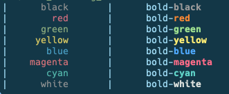

# Bash Scripts

## [test_if_varibale_contains_a_value.sh](/test_if_varibale_contains_a_value.sh)

```bash
#!/usr/bin/env bash

VARIABLE_WITH_STUFF="Things about stuff!"

VARIABLE_WITOUT_STUFF=""


###############################################################################
#     This should print "variable contains stuff" for $VARIABLE_WITH_STUFF    #
###############################################################################
if [[ (( $VARIABLE_WITH_STUFF )) ]]
then
    echo "this variable contains stuff: \$VARIABLE_WITH_STUFF: \"${VARIABLE_WITH_STUFF}\""
else
    echo "this variable is empty: \$VARIABLE_WITH_STUFF: \"${VARIABLE_WITH_STUFF}\""
fi

###############################################################################
#     This should print "variable is empty" for $VARIABLE_WITHOUT_STUFF    #
###############################################################################
if [[ (( $VARIABLE_WITOUT_STUFF )) ]]
then
    echo "this variable contains stuff: \$VARIABLE_WITHOUT_STUFF: \"${VARIABLE_WITHOUT_STUFF}\""
else
    echo "this variable is empty: \$VARIABLE_WITHOUT_STUFF: \"${VARIABLE_WITHOUT_STUFF}\""
fi
```

**Test Run:**
```yaml
./test_if_varibale_contains_a_value.zsh
```

**Outputs:**
```bash
this variable contains stuff: $VARIABLE_WITH_STUFF: "Things about stuff!"
this variable is empty: $VARIABLE_WITHOUT_STUFF: ""
```


## [Nested_For_Loops_Rename_Multiple_Files_in_Multiple_Directories.sh](/Nested_For_Loops_Rename_Multiple_Files_in_Multiple_Directories.sh)

```bash
#!/usr/bin/env bash
###############################################################################
#                                                                             #
#            Script to zero fill filenames in Kae's Code Examples!            #
#                                                                             #
###############################################################################
#                                                                             #
#           Ex: "Chapter 01/Pr1-1.cpp" -> "Chapter 01/Pr1-01.cpp"             #
#                                                                             #
# --------------------------------------------------------------------------- #
#                                                                             #
# Notes:                                                                      #
# * For loop with multiple sequences:                                         #
#   {1..5} {6..10} 15                                                         #
#   ex:                                                                       #
#       for i in {01..12} 20; do ...    // [01, 02, 03, 04, ..., 20]          #
#                                                                             #
# * To Strip Leading Zeros:                                                   #
#   i = 01                                                                    #
#   p = $((i+0))                        // p == '1'                           #
###############################################################################

SRC="/Users/katayama/Documents/School/Kae/CISC_114/code_examples/OneDrive_1_3-4-2023"

for i in {01..12} 20; do
    echo "Chapter $i";

    if [[ $i == 20 ]]; then
        p=$(expr $i - 1);
    else
        p=$(expr $i + 0);
    fi

    for j in {1..9}; do
        filenames rename "$SRC/Chapter $i" "Pr$p-$j.cpp" "Pr$p-0$j.cpp" #--preview;
    done;
done;
```


## [test_parse_flag_with_value.sh](/test_parse_flag_with_value.sh)

```bash
#!/usr/bin/env bash
#
# Dummy command to test parsing command line "flags: (-h, -p)" and "values: (project)".
#

PROJECT=false

function usage() {
    echo "Usage: $0 [-h] [-p project]"
    echo " -h help"
    echo " -p {project name}"
}

while getopts hp: args
do case "$args" in
       (p)
          PROJECT="$OPTARG";;
       (h)
          usage
          exit 1;;
       (*)
          usage
          exit 1;;
   esac
done

if [[ $PROJECT == false ]]; then
    usage
    exit 1;
fi

PROJECT_HOME=${HOME}/Documents/${PROJECT}
echo ""
echo "Launching project '${PROJECT}' from: \"${PROJECT_HOME}\""
```

**Test Run:**
```yaml
./test_parse_flag_with_value.zsh
```

**Outputs:**
```bash
Usage: ./test_parse_flag_with_value.zsh [-h] [-p project]
 -h help
 -p {project name}
```

**Test Run:**
```yaml
./test_parse_flag_with_value.zsh -h
```

**Outputs:**
```bash
Usage: ./test_parse_flag_with_value.zsh [-h] [-p project]
 -h help
 -p {project name}
```

**Test Run:**
```yaml
./test_parse_flag_with_value.zsh -p
```

**Outputs:**
```bash
./test_parse_flag_with_value.sh: option requires an argument -- p
Usage: ./test_parse_flag_with_value.sh [-h] [-p project]
 -h help
 -p {project name}
```

**Test Run:**
```yaml
./test_parse_flag_with_value.zsh -p "Test Project"
```

**Outputs:**
```bash
Launching project 'Test Project' from: "/Users/katayama/Documents/Test Project"
```


## [How_to_Comment_Multiple_lines.sh](/How_to_Comment_Multiple_lines.sh)

```bash
#!/usr/bin/env bash

: <<'END'


This is a multiline comment (a.k.a "a comment block")

Everything between the top and bottm "END" lines are commented out.


END
```


## [How_to_Add_Numbers.sh](/How_to_Add_Numbers.sh)

```bash
#!/usr/bin/env bash

# Test that "3 + 4 + 3 == 10"
echo ""
echo "EQ = \"3 + 4 + 3\" = ?"

EQ="3 + 4 + 3"
echo "EQ = \"${EQ}\" = $(expr $EQ)"
echo ""
### OUTPUTS ###
# EQ = "3 + 4 + 3" = ?
# EQ = "3 + 4 + 3" = 10

# Test that "2 + 4 == 6" but this time using variables
NUM="2"
SUM=$(expr $NUM + 4)

echo "NUM = 2"
echo "NUM + 4 = ?"
echo "NUM + 4 = ${SUM}"
echo ""

### OUTPUTS ###
# NUM = 2
# NUM + 4 = ?
# NUM + 4 = 6
```


## [Test_Printing_Colors.zsh](/Test_Printing_Colors.zsh)

```bash
#!/usr/bin/env zsh


for color in {black,red,green,yellow,blue,magenta,cyan,white}; do
    print -P "| %F{$color}${(l:10:)color}%f ${(l:5:)} | ${(l:5:)}bold-%B%F{$color}${color}%f%b"
done;
```

**Test Run:**
```yaml
./Test_Printing_Colors.zsh
```

**Outputs:**


